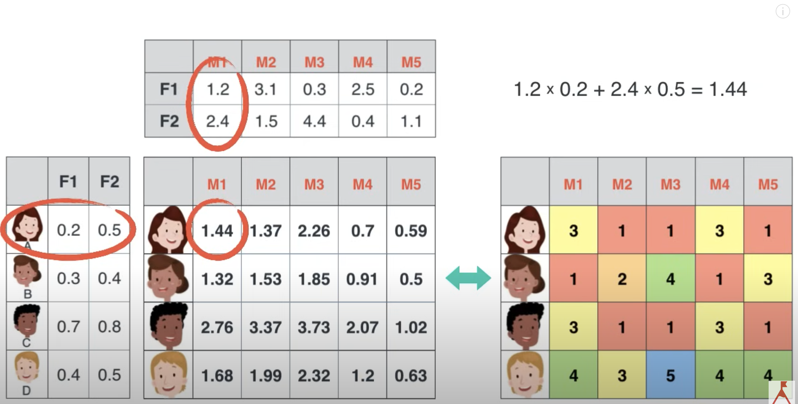
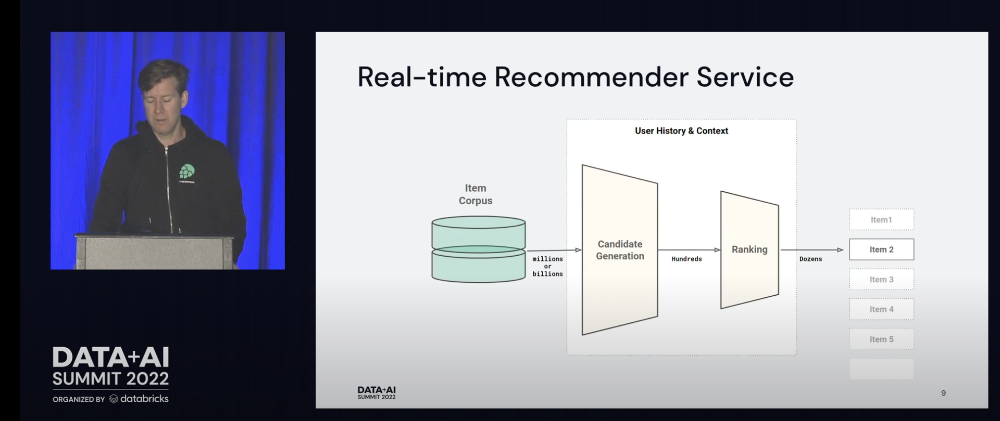
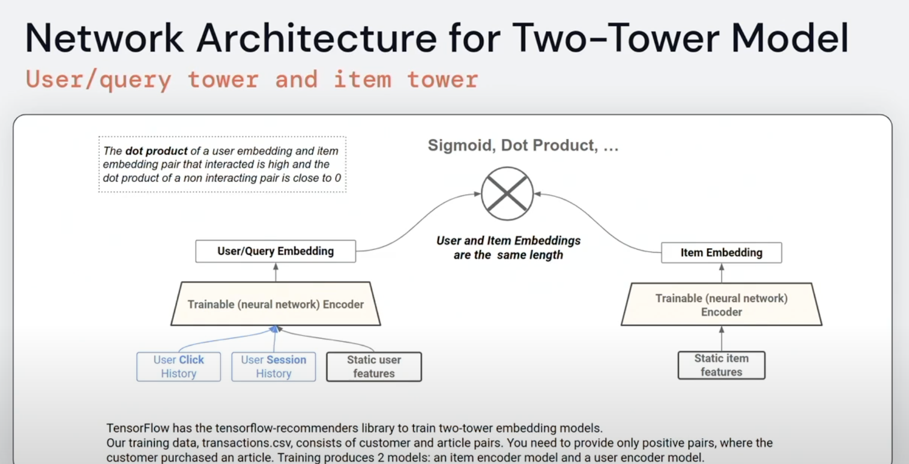

This repository has recommender system code related to collaborative learning and retrieval & ranking.

The recommender.ipynb comes from the following Recommender System tutorial on collaborative learning:
https://www.youtube.com/watch?v=XfAe-HLysOM
https://github.com/topspinj/tmls-2020-recommender-workshop

This notebook has additional notes, modifications, and code I added as I went through the tutorial. Some supplemental movie ratings were also added to the ratings file dataset.

This collaborative filtering includes item-to-item and user-to-user(to-item) movie recommendations via vector similarity or distance analysis. This type of recommender system may tend to fall under batch recommendation systems, where the model is trained every day/week/month in a large batch offline and recommended items are saved to a database and served to the user at next login. This might make sense for feature-length movies where you want to recommend movies that span the past six decades, but it may not have temporal features or aspects that capture/emphasize/weight the new, viral, or relevant to what you just engaged with. It would be possible to modify this approach in various ways (e.g. use the last rated movie as the item for making the next recommendation) and we also look at "two tower" retrieval & ranking approach that captures some of these temporal, viral, session-relevant aspects for making recommendations.

There is still more to explore here on different aspects of collaborative learning. Even though collaborative filtering is simpler in theory than the Retrieval & Ranking recommendation approach, there is still a lot to think about. Some things to explore include distance metric considerations (e.g. Euclidean, Cosine Similarity, etc.), pre-processing (e.g. ways to handle missing values in sparse vectors (e.g. imputing average, ignoring, treating as 0, treating as infinity), post-processing code (e.g. filter movies that were seen already), composite utility values (e.g. utility_matrix[user_i][movie_j] = user_i_hours_watched_movie_j + user_i_rating_movie_j + 2 * user_i_likes_movie_j + 5 * user_i_shared_movie_j + 2 * user_i_comment_on_movie_j), normalization (e.g. user_i_rating_movie_j/avg(user_i_rating) ), etc. 

We did explore gradient descent (instead of Singular Value Decomposition) for matrix factorization. Matrix factorization of the 610users X 10_000movies is one way to help derive user and item embeddings for representing users and items in a compressed way. You could imagine a vector of just 20 floats instead of 10000 sparsely rated movies representing a user, or a different set of 20 floats representing a movie. (The dot product of user i and movie j embeddings would hopefully give you a number that isn't too far off what you see in the utility matrix.) An additional benefit to working with compressed embeddings may be that you no longer have to worry about how to handle missing components in your (vector) distance metric in an unbiased way, as the user and item embeddings won't be sparse.

We are also going to look at real-time recommendations using a Retrieval & Ranking architecture. In this approach, we go from billions of possible item candidates
down to hundreds in an Approximate K Nearest Neighbor (lower time complexity than actual KNN) retrieval step, and then run each of those through a predictor for ranking purposes. The user session features (e.g. recent clicks, likes, comments, shares) can then be used (and updated) for making constantly recomputed recommendations that have some geographically/network-local and recent temporal context features. We will explore a "two (ReLu) tower" (neural net) architecture for training a recommendation predictor. A potential benefit of a two tower approach (over a one ReLu tower neural net) is that you are bringing the enriched user and item embeddings together in a dot product at the end, right before prediction and then the subsequent start of back propagation. The dot product could be followed by a sigmoid for squashing between 0 and 1 if click/no-click is your ground truth, or maybe a ReLu if your ground truth is a composite utility metric that can range from say 0 to 15. (Cost function to optimize: Log Loss for 0-to-1 outputs and Mean Square Error for 0-to-15) For this kind of model, we may do something like user-item utility matrix factorization to get the static user and item embeddings, and then add the context (recent likes, clicks, comments, forwards, save, friend activity/likes, etc.) into the user tower. The item embedding could get some meta data concatenated if we wanted to enhance its embedding.

Post-processing is always needed. We can filter for inappropriate content, already watched videos, or just generally reshuffle the ranking results for diversity of items or any other reason (including advertising/promoting).

We will also consider the inference time and scalability. We have horizontal scaling and parallel processing for our two tower approach.

https://www.youtube.com/watch?v=9vBRjGgdyTY

